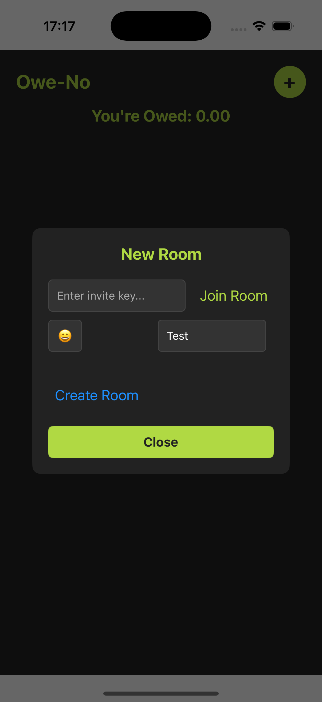
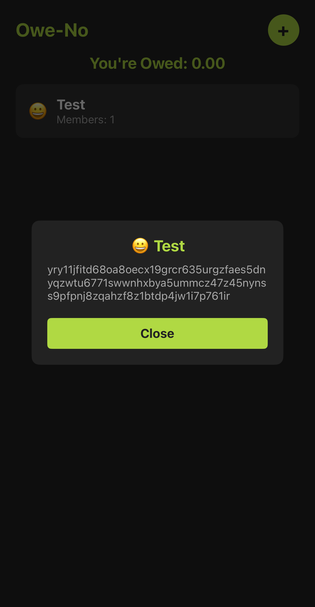
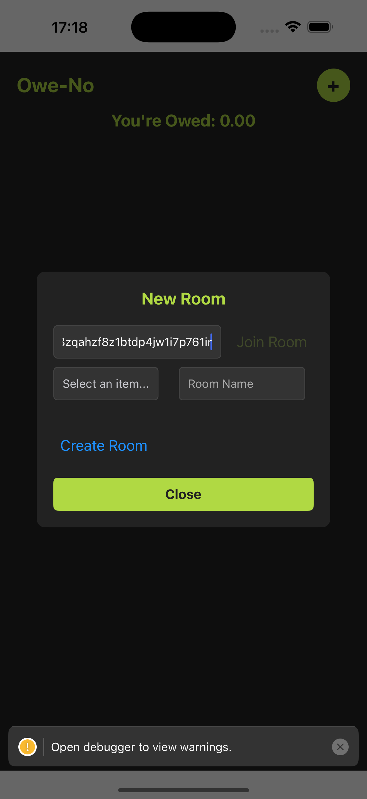
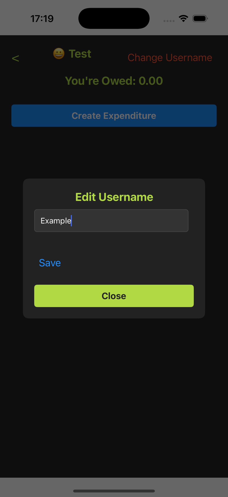
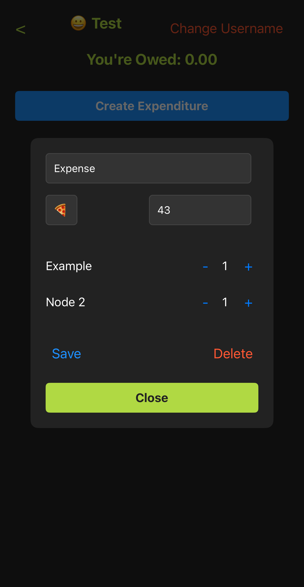
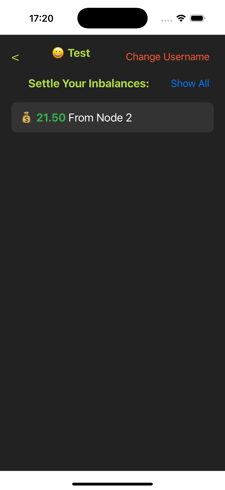
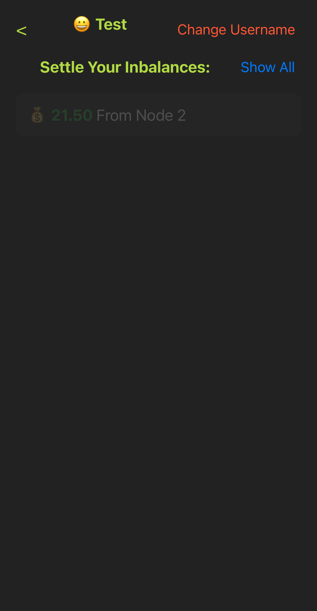
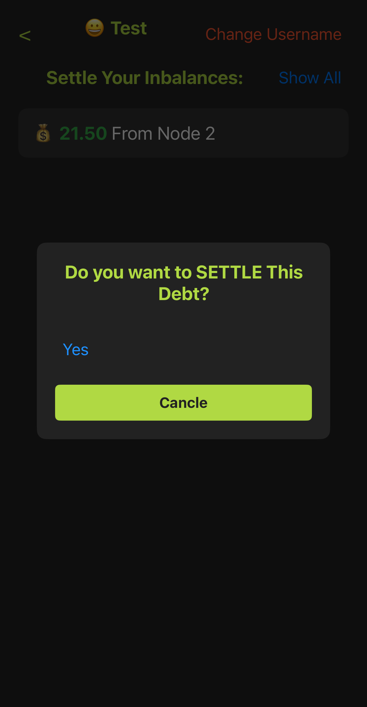
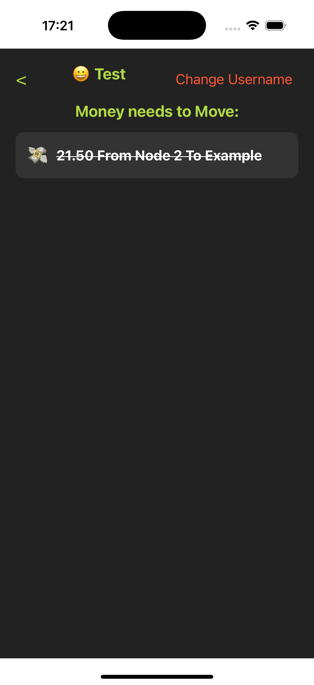
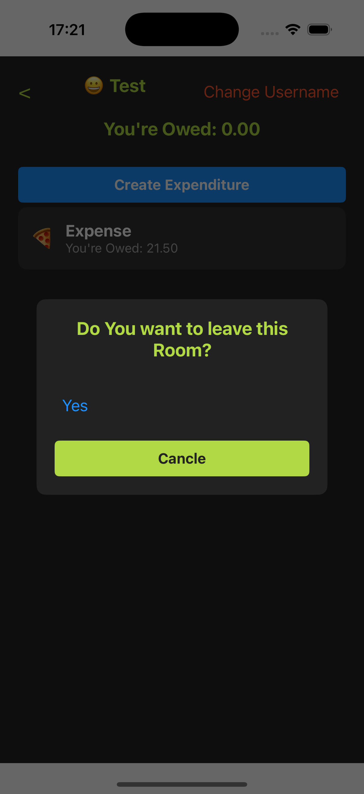

# 📱 P2P Debt Management App

A **decentralized mobile app** to split expenses, manage debts, and calculate optimal transfers among friends. Built with **Hyperswarm, Hypercore, Corestore, Hyperbee, Autobase, and Blind Pairing** for secure and efficient peer-to-peer (P2P) connections.

---

## 🚀 Features

- 🔗 **P2P connections** with Hyperswarm
- 📦 **Decentralized storage** using Hypercore, Corestore & Hyperbee
- 🔄 **Sync across peers** with Autobase
- 🔑 **Secure blind pairing** for connecting storages
- ⚖️ **Optimized debt settlement** with minimal transactions
- 🏡 **Rooms for shared expenses**
- ✍️ **Editable expenditures & user adjustments**
- 💰 **Track settlements & optimize transfers**

---

## 📥 Installation

Before installing dependencies, make sure `bare` is installed globally:

```sh
npm install -g bare
```

Then, install project dependencies:

```sh
npm install
```

---

## 📦 Build

Generate the app bundle:

```sh
npx bare-pack --target ios --target android --linked --out app/app.bundle.mjs backend/backend.mjs
```

---

## ▶️ Run the App

### On iOS

```sh
npm run ios
```

If you encounter a build error, try:

```sh
npm run ios
```

---

## 🔄 Usage Guide

### 1️⃣ Create a New Room

<p align="center">
  
  
  
</p>

### 2️⃣ Copy the Invite Link

<p align="center">
  
</p>

### 3️⃣ Join the Room on Another Node

<p align="center">
  
</p>

### 4️⃣ Change Your Username

<p align="center">
  
  
</p>

### 5️⃣ Add & Edit Expenses

<p align="center">
  
</p>

### 6️⃣ Check Transfers for Settlement

<p align="center">
  
  
</p>

### 7️⃣ Settle Debts

<p align="center">
  
  
  
</p>

### 8️⃣ View All Settlement Transfers

<p align="center">
  
</p>

### 9️⃣ Leave the Room

<p align="center">
  
  
</p>

---

## 🛠️ Tech Stack

- **Networking:** Hyperswarm
- **Storage:** Hypercore, Corestore, Hyperbee
- **Data Syncing:** Autobase
- **Security:** Blind Pairing

---

## 🌍 Why Decentralized?

This app removes the need for central servers, giving users:
✅ **Privacy-first transactions**  
✅ **No reliance on third parties**  
✅ **Offline-first functionality**

---

## 💡 Future Improvements

- 🔐 Enhanced security with encrypted transactions
- 📊 Advanced analytics for expense tracking
- 🌐 Web support for desktop users

---

## 📜 License

This project is licensed under the Apache License 2.0. See the [LICENSE](LICENSE) file for details.

---

🚀 **Built for a Hackathon – Join us in revolutionizing decentralized finance!**
