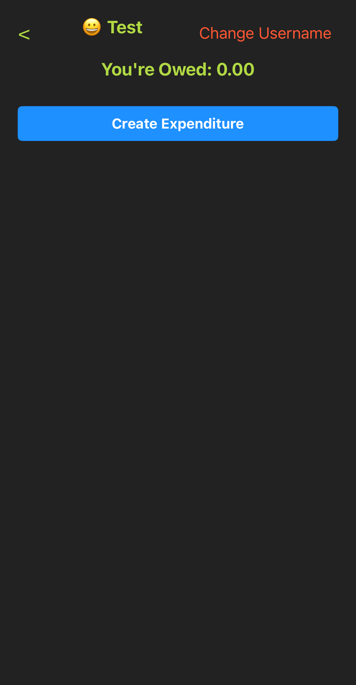
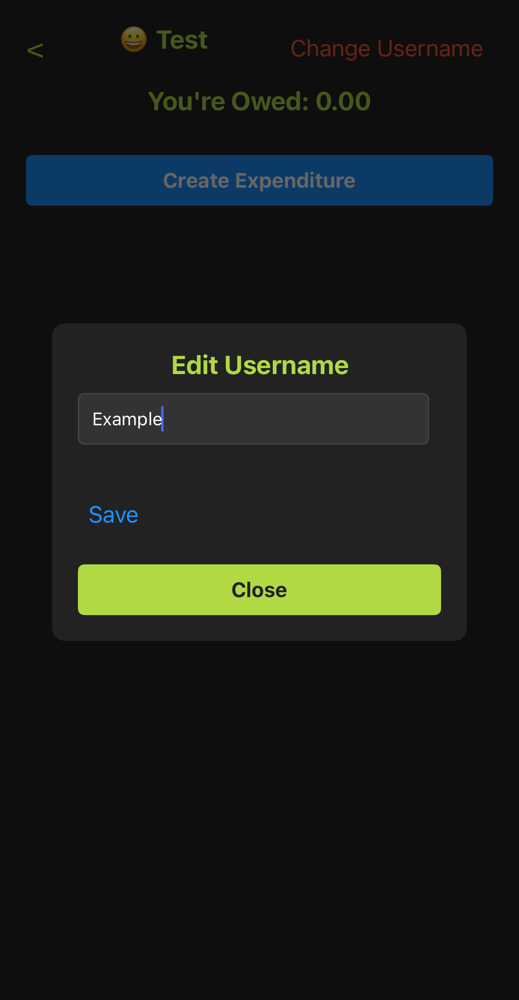
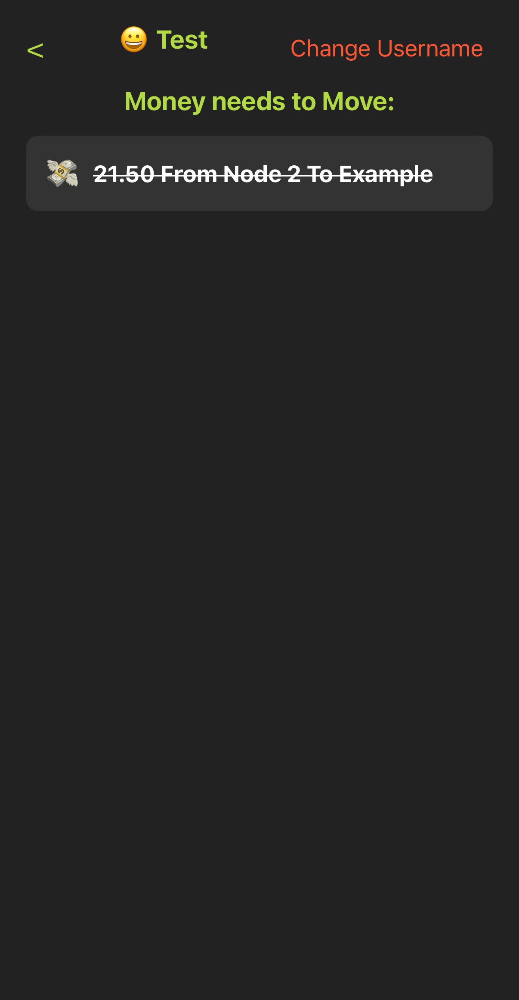
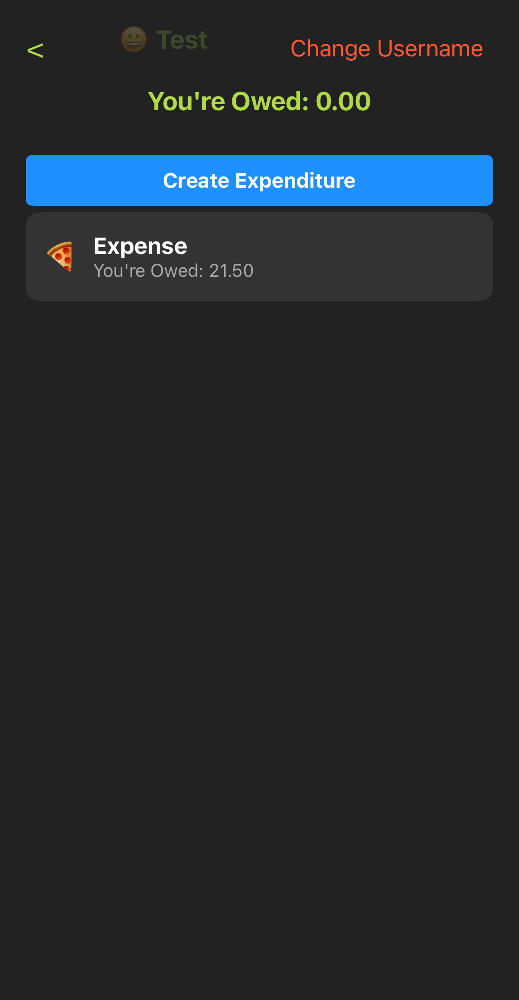

install dependencies

```sh
npm install
```

Generate a bundle

```sh
 npx bare-pack --target ios --target android  --linked --out app/app.bundle.mjs backend/backend.mjs
```

run the app on iOS.

```sh
npm run ios
```

if you get a built error try npm

```sh
npm run ios
```

first

create a new room.


copy the console loged invite.


paste any join on other node.


change username.



create and edit expenditures and adjust parts (can also edit afterwards).


check transfers for settlement.


settle debts.


check settlement transfers for whole room.


leave room.


